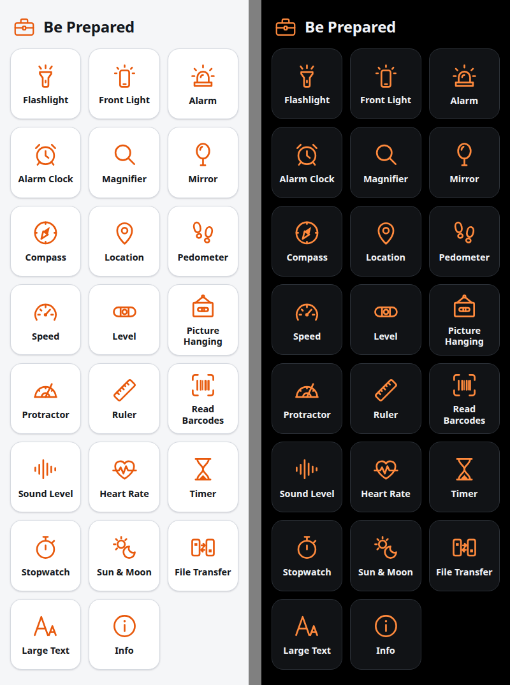
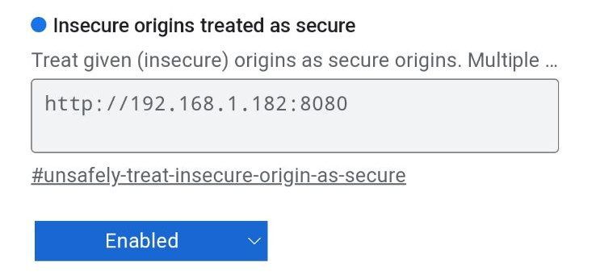

# Be Prepared

A toolbox of 24 everyday tools in one small app: flashlight, compass, level, magnifier, timers, alarm clock, barcode reader, and more. It works completely offline, which makes it handy in the field and a good way to turn a spare phone into something useful.

**Use it at [be-prepared.github.io](https://be-prepared.github.io).**



## Private by design

* Nothing uses the internet once the app is loaded. There are no accounts, ads, analytics, or trackers.
* Nothing you do leaves your device. Camera, microphone, and sensor data are processed on the spot and never recorded or sent anywhere.
* The only things saved are your own settings and data (waypoints, alarms, ruler calibration), in your browser's local storage.
* The code is open. Please feel free to audit it.

## Installing and updating

Be Prepared is a Progressive Web App (PWA). Open the site and use your browser's "Install" or "Add to Home Screen" option to get an app icon. It also runs fine in a browser tab.

It works best in **Chrome on Android** and **Safari on iOS**.

The app updates itself when you are online. When a new version has downloaded, a drawer at the bottom of the screen offers to reload. To be sure you have the latest version: open the app while online, wait a minute, close it, then open it again.

## The tools

What each tool needs is listed after the description. Tools are only hidden from the home screen when your device doesn't have the hardware.

**Rearranging the home screen:** press and hold a tool, then drag it to a new spot. The tool's old spot stays open until you let go, then it moves. Reset preferences in Info to go back to the original order.

### Light and signaling

| Tool | What it does |
| --- | --- |
| **Flashlight** | Turns on the camera's light and keeps the screen awake. *Camera.* |
| **Front Light** | Turns the whole screen white, for phones without a camera light. |
| **Alarm** | Strobe the flashlight, sound a siren, and flash the screen, in any combination. Screen flashing stays under 3 flashes per second (a photosensitivity guideline). |
| **Magnifier** | Camera view starting at full zoom, plus up to 8× digital zoom on top. Pinch or use the zoom buttons, freeze the image, and toggle the light. *Camera.* |
| **Mirror** | Front camera, flipped like a real mirror, with digital zoom, freeze, and a white "light ring" border for dark rooms. *Camera.* |

### Getting around

| Tool | What it does |
| --- | --- |
| **Compass** | Works flat, upright, and in landscape. Warns when the compass needs calibration and when Low Power Mode is stopping the sensors. *Compass sensor.* |
| **Location** | Your coordinates in DMS, DDM, DDD, UTM/UPS, MGRS, or Plus Codes; saved waypoints; navigation to a waypoint; and averaging many readings for an accurate position. Coordinates can be typed in shorthand (see [Entering coordinates](#entering-coordinates)), and waypoints can be shared several ways (see [Sharing a waypoint](#sharing-a-waypoint)). Fields are configurable (see [Location fields](#location-fields)). *GPS.* |
| **Pedometer** | Distance traveled by GPS with start, pause, and reset, pace, and an estimated step count from your stride length. Filters out GPS jitter so standing still doesn't add distance. *GPS.* |
| **Speed** | Current, average, and maximum speed in mph or km/h. *GPS.* |
| **Sun & Moon** | Sunrise, sunset, twilight, moonrise, moonset, positions, and moon phase for any place and date. Find places by coordinates or the name of a major city. |

### Measuring

| Tool | What it does |
| --- | --- |
| **Level** | *Surface* mode is a bullseye for a phone lying flat. *Bars* mode works like a construction level, with one vial across the screen and one along it. Readings to one decimal, and each mode can be zeroed to cancel out a phone case. *Motion sensor.* |
| **Picture Hanging** | Camera view with a full-screen "+" and a second "+" aligned with the real horizon, plus how far off level you are left/right and toward/away from the wall. *Camera and motion sensor.* |
| **Protractor** | Drag two rays to measure an angle, over the camera view or a plain background. |
| **Ruler** | Centimeters and inches along the screen edges. Calibrate once with any credit or ID card for accurate measurements. |
| **Sound Level** | Approximate sound level in dB(A) with minimum, average, and maximum, and the matching category (quiet room, conversation, traffic, and so on). *Microphone.* |
| **Heart Rate** | Place a fingertip over the rear camera and its light; the camera detects your pulse from tiny color changes. Not a medical device. *Camera, works best with a flashlight.* |
| **Metal Detector** | Shows changes in the magnetic field, which finds iron, steel, and magnets. *Magnetometer, only available in Chrome with experimental sensor features turned on.* |

### Time

| Tool | What it does |
| --- | --- |
| **Alarm Clock** | One-time or repeating alarms with labels and snooze, plus a dim Nightstand mode. See the [limits](#limits-to-know-about). |
| **Timer** | Countdown with presets. It rings no matter which tool is open. |
| **Stopwatch** | Start, stop, and laps, with the fastest and slowest laps highlighted. |

### Information

| Tool | What it does |
| --- | --- |
| **Read Barcodes** | Reads the 1D and 2D barcodes your device supports, falling back to a built-in reader when the browser has none. You can also choose the reader yourself. Links are tappable. *Camera.* |
| **NFC** | Reads NFC tags and shows what's on them, including smart posters with several records inside. *NFC, Chrome on Android.* |
| **File Transfer** | Send a file from one device to another with a stream of QR codes, no network needed. See [File Transfer](#file-transfer). *Camera to receive.* |
| **Large Text** | Shows a message as large as the screen allows, readable from a distance. |
| **Info** | Share the app, see which hardware and permissions are available and which browser was detected, change preferences (coordinates, units, 12/24-hour time, barcode reader), and view build details. |

## Permissions

* Each tool asks for a permission only when you open it, and explains why first.
* Nothing about permissions is remembered by the app. If you deny one, the tool stays on the home screen, explains how to allow it again in your browser's settings, and offers a "Try Again" button.
* Phones that offer more than one camera on a side get a Switch Camera button in the tools that show the camera (magnifier, mirror, protractor, picture hanging, barcode reader, and file transfer). Your choice is remembered. Many phones, including most iPhones, only offer one per side to web apps, and then there's no button.
* The camera and microphone are only on while their tool is open. They turn off when you leave the tool or switch away from the app.

## Languages

Be Prepared is available in English, Arabic, Chinese (Simplified), French, German, Indonesian, Japanese, Portuguese, Russian, and Spanish. It uses the first language in your browser's list that it has, and you can pick another on the Info screen. Every language is stored on the phone, so switching works offline.

**Help wanted:** the translations other than English were machine-assisted and haven't been reviewed by native speakers yet. If you spot an awkward or wrong phrase, or want to add a language, please [open an issue](https://github.com/Be-Prepared/Be-Prepared.github.io/issues) or a pull request. Translations are in `src/i18n/translations/`, one file per language, with the English in `src/i18n/en-us.ts` and the `*.i18n.ts` file next to each tool. `npm test` checks that every language has every string with the same `{{placeholders}}` and HTML tags.

## Limits to know about

A web app can do a lot, but not everything a native app can. Be Prepared tries to be upfront about this in the app itself.

* **Alarms and timers only ring while the app is open with the screen on.** A web app can't wake a sleeping phone or make sound in the background. Sound follows your media volume and can't get past silent mode or Do Not Disturb. For overnight use, open the Alarm Clock's Nightstand mode, plug the phone in, and turn the media volume up. Don't rely on it as your only wake-up alarm. If an alarm comes due while the app is closed, it's shown as missed the next time you open it.
* **Sensor readings are only as good as the phone.** Compass accuracy depends on calibration and nearby metal. The level can resolve a few tenths of a degree. Sound levels are estimates, since phone microphones aren't calibrated. The ruler is approximate until you calibrate it with a card.
* **Some features depend on the browser.** iOS doesn't let web apps control the camera's zoom or light, so the magnifier uses digital zoom there and the heart rate monitor may not work. NFC needs Chrome on Android. The metal detector needs an experimental Chrome setting.

## Tool details

### Location fields

The Location tool can show many different fields; tap a field to change it. Fields marked "navigation only" are available while navigating to a waypoint and reset when you leave that screen.

* **Accuracy:** How far off the GPS position could be. Whoever gave you coordinates could also have been off a bit, so expect to be close to the spot rather than exactly on it.
* **Altitude** and **Altitude Accuracy:** Height above sea level, and how accurate it is. Accuracy is often not available.
* **Arrival Time** (navigation only): When you're expected to arrive.
* **Ascent** and **Descent** (Total, Average, Min, and Max): How much you've climbed and dropped, and how fast. GPS altitude wanders by 5 to 15 m even when you stand still, so the altitude is smoothed and a climb or drop only counts once it moves at least 3 to 10 m (based on the reported altitude accuracy) from the last counted altitude. Average is the total divided by the time spent climbing (or descending), so rests don't lower it. Min and Max are the slowest and fastest rates measured over stretches of about 30 seconds. Rates are in m/s or ft/min. Without a barometer, slow GPS drift can still add a little phantom climbing, and each summit or valley can be off by a few meters.
* **Bearing** (navigation only): The direction to the waypoint.
* **Current Time:** In 12-hour or 24-hour format.
* **Destination** (navigation only): The waypoint's name.
* **Distance** (navigation only): How far away the waypoint is.
* **Distance Traveled:** How far you've moved while the GPS was on.
* **Glide Ratio:** Distance covered forward for each unit of altitude lost over the last minute, such as "12:1". Shows "—" unless you've dropped at least 3 m in that time.
* **Heading:** Your direction of travel as reported by the GPS, or calculated when it isn't reported.
* **Heading (Smoothed):** Direction of travel over the last five readings, using a [Kalman filter] that accounts for GPS accuracy to remove jumps and spikes.
* **Relative Bearing** (navigation only): Which way to turn to face the waypoint compared to your direction of travel, such as "35° right". Unknown while standing still, because GPS has no heading then.
* **Speed:** As reported by the GPS, or calculated when it isn't reported.
* **Speed (Smoothed):** An exponential moving average of the last five speeds, which removes spikes and dips.
* **Time Elapsed** (navigation only): How long you've been navigating.
* **Time Moving** and **Time Stopped:** Time spent at or above 0.35 m/s (just under 0.8 mph), and below it. These accumulate while you're on any Location screen and reset if you leave for more than a few seconds.
* **Time Remaining** (navigation only): How much longer until you arrive.
* **Velocity Made Good** (navigation only): How fast you're closing in on the waypoint: your speed times the cosine of the angle between your direction of travel and the waypoint. Negative when moving away.
* **Vertical Speed:** How fast you're climbing (positive) or descending (negative), from the smoothed altitude. Shown in m/s or ft/min.

**Averaging a location:** Location averaging first ignores readings that report an accuracy more than three times worse than the median (usually Wi-Fi or cell tower fixes). It then takes a robust (Huber) average of the rest on a flat east/north map around the spot: readings near the middle count fully, and readings that jump far away, as reflections off buildings and trees cause, count less the farther out they are. The accuracy shown is a 95% radius for the average itself. If GPS errors were independent it would shrink with the square root of the number of readings, but reflection and satellite geometry errors drift over many minutes and atmosphere errors over hours, so a reading every second mostly repeats the same error. The app assumes errors become independent after about 20 minutes, counting an effective 1 + (minutes collected ÷ 20) readings (4 after an hour), and assumes 5% of the error never averages away within a session. The size of a single reading's error is the larger of the reported accuracy (treated as a 68% radius, as Android defines it) and the actual scatter of the readings, corrected for the part of the error all of them share. The radius is about 2.45 times the resulting standard error. In simulations of open sky and urban conditions this radius held the true spot 94–98% of the time, where the previous method's held it only 75% of the time in open sky; see `experiments/averaging/README.md`. Expect the radius to keep shrinking for a couple of hours and then level off at about a third of a single reading's reported accuracy. Each averaging session starts fresh.

### Entering coordinates

Anywhere you type a location (waypoints, Sun & Moon), these work:

* Decimal degrees, degrees and minutes, or degrees, minutes, and seconds, with or without N/S/E/W.
* UTM/UPS (`17T 630084 4833438`) and MGRS/USNG (`18S UJ 23371 06519`).
* Plus Codes, full (`849VCWC8+R9`) or short with a city (`CWC8+R9 Mountain View`).
* The name of a major city.
* **Shorthand** that fills in the rest from your current location: MGRS without the zone (`UJ 2337 0651`, or just `2337 0651`), UTM without the zone (`123456 1234567`), and short Plus Codes (`CWC8+R9`). The closest matching place to you is used. Shorthand needs location access.

### Sharing a waypoint

Map apps don't agree on how to read a shared location. Notably, iPhones don't open `geo:` links in Apple Maps and treat their name as a search. The Share button on a waypoint lets you pick a format, then shows a QR code with Share and Copy buttons:

| Format | Name included | Best for |
|---|---|---|
| Be Prepared link | Yes | Anyone with Be Prepared; adds the waypoint directly. |
| Geo link with name | Yes | Android map apps (labeled pin). Some apps search for the name instead. |
| Geo link, coordinates only | No | Android GPS and offline map apps that mishandle the name. |
| Google Maps | No | Any phone or computer with a web browser. |
| Apple Maps | Yes | iPhones. Other devices open the Apple Maps website. |
| Decimal coordinates | No | Pasting into any map's search box. |
| Name and coordinates | Yes | GPS units or reading aloud, in your coordinate format. |

### File Transfer

* The sender shows an endless stream of QR codes. Each one mixes a random set of the file's blocks (a [fountain code](https://en.wikipedia.org/wiki/Fountain_code)), so the receiver doesn't need any particular frame, just enough of them: about 0.5% more frames than the file has blocks. That holds whatever the loss: 90% of frames missed, bursts of missed frames, or a receiver that only starts pointing its camera minutes later. Missed frames only cost time. The numbers are in [experiments/transfer](experiments/transfer/README.md).
* While receiving, a status like "2/1700 (+ 104) @ 7.98 FPS" means 2 of 1,700 blocks are decoded, and 104 captured frames are waiting for more pieces. The last blocks usually all arrive at once. Frame rates are approximate.
* Larger sizes put more of the file in each QR code. They're faster when the receiving camera can read them, and slower when it can't. Files are compressed when that makes them smaller.
* Protocol version 2 isn't compatible with the old format or with [QRS](https://github.com/qifi-dev/qrs#readme), so both phones need a current version of Be Prepared.

### Major cities

Sun & Moon can look up about 10,000 of the world's largest cities by name. Use just the city name ("Minneapolis", not "Minneapolis, MN"). The list starts with every city of 15,000 people or more, keeps the most populated city when names repeat, then keeps the largest 10,000. Coordinates are packed with a base-92-style encoding to keep the app small.

## For developers

### Getting started

You'll need Node.js 22 or newer.

```bash
git clone https://github.com/fidian/be-prepared.git
cd be-prepared
npm install
npm start
```

The dev server runs at `http://localhost:8080/` and is reachable from other devices on your network at your computer's IP address, which is shown when it starts.

| Command | What it does |
| --- | --- |
| `npm start` | Development server with live reload. |
| `npm test` | Type checks and runs the unit tests with Node's built-in test runner. Tests live next to the code as `*.test.ts`. |
| `npm run test:e2e:docker` | Browser tests in Chromium, Firefox, and WebKit (desktop and phone sizes), inside Playwright's Docker image so screenshots match CI. Add `-- --update-snapshots` after an intended visual change. |
| `npm run test:e2e` | The same browser tests without Docker. Screenshot comparisons may fail because fonts differ. |
| `npm run size` | How much each feature, library, and file adds to the app. |
| `npm run build` | Type checks and builds the site into `dist/`. |
| `npm run generate-pwa-assets` | Regenerates the launcher icons from `site/public/app-icon.svg`. |
| `npm run tunnel` | Shares your dev server over HTTPS on the internet (see below). |

Pushing to `master` runs the unit tests and the browser tests, and deploys to GitHub Pages only if both pass.

The app is written in TypeScript with [Fudgel](https://github.com/fidian/fudgel), an extremely lightweight web component library, plus RxJS, and built into a PWA with Vite. **[AGENTS.md](AGENTS.md) describes the project layout, conventions, and pitfalls** and is worth reading before making changes, whether you're a person or an AI agent.

### Testing on a phone

Most tools need a real phone, and browsers only allow cameras and sensors on secure (HTTPS) pages.

* **Remote tunnel (easiest):** Run `npm start` in one terminal and `npm run tunnel` in another. Open the generated URL and enter your *public IP address* as the password.
* **Android and Chrome:** Open `chrome://flags#unsafely-treat-insecure-origins-as-secure`, add your computer's address (for example `http://192.168.1.10:8080`), and enable the option. You can also connect a USB cable and use [remote debugging](https://developer.chrome.com/docs/devtools/remote-debugging).

    

* **iOS and Safari:** Use a remote tunnel, or a local debugger as described in [this article](https://www.closingtags.com/remote-debugging-web-apps-on-ios-from-linux/).

### Debugging on a phone

[Eruda](https://github.com/liriliri/eruda) is a developer console for mobile browsers. Turn it on by adding `?eruda` to the URL or by tapping the "Build Information" heading on the Info screen ten times. It turns off when you close and reopen the app, or after ten more taps. Turning it on or off reloads the page, and Eruda starts before the app so every message and error is captured. Eruda is loaded from a CDN, so it needs a network connection; it's a developer tool only.

### Contributing

Pull requests are welcome. Please keep to the intent of the app:

* Every tool works offline. No fetching resources from the network.
* No data leaves the device. `localStorage` is fine for settings; avoid other access to local files.
* Ask for permissions only when a tool is used, never cache permission results, and release hardware when it's not needed.
* Be honest in the UI about accuracy and platform limits.
* Keep animations and extras minimal to save battery and space.
* Add unit tests for logic, and check your screens in portrait, landscape, light mode, and dark mode.

**Icons** are SVG, drawn on a 24×24 grid with `stroke="currentColor"` so they follow the light or dark theme.

[Kalman filter]: https://en.wikipedia.org/wiki/Kalman_filter
