# Be Prepared

A toolbox filled with offline-only tools. Useful for your everyday life and can turn your backup phone into a useful device. Nothing uses the internet, accesses local files, or sends content to a remote server. I care about your privacy and security, so please feel free to audit the code.

Use this application at [Be-Prepared.github.io](https://be-prepared.github.io). It's a PWA and is installable as an application or you can run it from your web browser. Because it's a PWA, it can only auto-update itself when you are online. This can happen in the background or when you launch the application. You can detect if a new version is available by a drawer that opens on the bottom after the update is downloaded. An easy way to ensure you have the latest version is to make sure you are on the internet and run the app, wait a minute, close the app, then open it again.

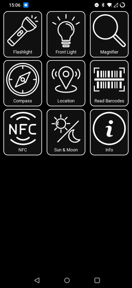

This PWA is also an example for how to use the following:
    * [Fudgel](https://github.com/fidian/fudgel), an extremely lightweight web component library.
    * Vite to make a PWA.
    * Querying permissions and accessing sensors across several types of devices.
    * Responding to dark mode.
    * Internationalization (automatic translation based on available languages and browser settings).

## What's included

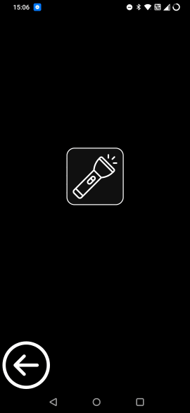

* Flashlight
    * Simply turns on the camera's flashlight.
    * Uses the `camera` permission.
    * Sets the `torch` capability on a video track. If the capability is not there or the device doesn't report any video devices, the status moves to "unavailable". This information is cached so it isn't queried the next time you start the app.
    * Keeps the screen on, otherwise the flashlight will turn off.


* Front light
    * Makes the screen white. Useful for devices without a flashlight on the camera.
    * Keeps the screen on, otherwise this would be pretty pointless.

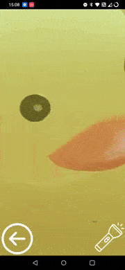

* Magnifier
    * Uses the camera and starts it at maximum zoom.
    * Requires the `camera` permission. This permission and the results of probing for a camera are cached so it isn't queried the next time you start the app.
    * Can turn on and off the camera's light, if one exists.

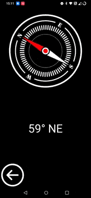

* Compass
    * A simple compass that shows your bearing.
    * Requires a magnetometer (compass) in the device. Can work from being laid flat and up to vertical by using a 3D sensor.
    * Your compass is likely not calibrated and calibration detection is disabled in PWAs. To increase accuracy, slowly turn your device around in all axis several times.

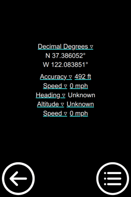 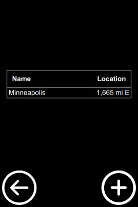 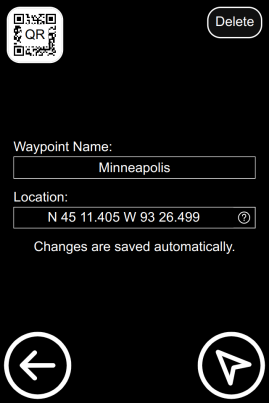 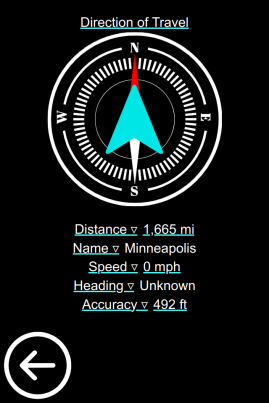

* Location
    * Show your current location using DMS, DDM, or DDD formats for coordinates as well as UTM/UPS and MGRS by tapping on the coordinates.
    * List your speed and accuracy using imperial (feet/miles) or metric (meters/kilometers) by tapping on the relevant fields.
    * Automatically will use high resolution locations (GPS) and will calculate your speed and heading even when the device doesn't support these fields.
    * Ability to change field functions (especially for Geocaching and the Geocaching merit badge). See field functions section (below) for more information.
    * Keeps the screen enabled while navigating to a point.

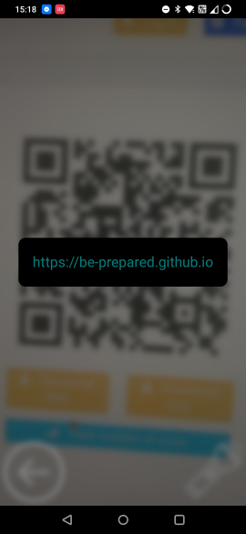

* Barcode reader
    * Reads all 1d and 2d barcodes that your device allows.
    * Falls back to WASM module if the device doesn't have a barcode scanning library built-in.

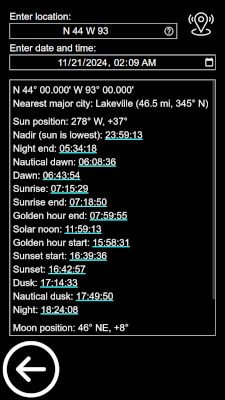

* Sun & Moon
    * Look up information for any location (by coordinates or use a major city's name).
    * Show location in current coordinate system, plus direction and distance to nearest major city.
    * Shows sunrise, sunset, and current sun location.
    * Moon's rise, moon's set, and the current moon location and phase.

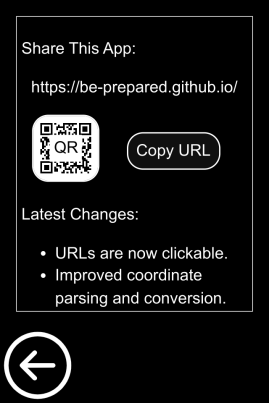

* Info
    * Contains a QR code for easy sharing of the application, or copy the URL to your clipboard.
    * Shows permission statuses that the application could use and current preferences. Allow resetting of preferences..
    * Gives credit to the tooling that helped make this project.
    * Shows the current build information.

## Field Functions

The Location app can show a number of different fields. The majority can be used at any time and a select few are available only during navigation to a waypoint. Any figures that indicate "Navigation only" will all reset if you leave the navigation screen.

* Accuracy: The GPS's accuracy with regard to longitude and latitude. This is how far off you could be from the actual location. Keep in mind that whomever gave you coordinates also could have been off by some distance; you should be close to the right spot but probably not exactly at the right spot.
* Altitude Accuracy: How accurate the GPS's altitude measurement is. Not often available.
* Altitude: Your position above (or below) sea level.
* Arrival Time (Navigation only): The estimated time for when you will arrive at your destination.
* Bearing (Navigation only): The direction of the waypoint from your location.
* Current Time: The current time, in either 24-hour or 12-hour format.
* Destination (Navigation only): Destination waypoint's name.
* Distance (Navigation only): How much distance is between you and your destination.
* Distance Traveled: How far you've traveled while having the GPS enabled.
* Heading: When available, this is the heading reported by your GPS. If not available, this will be calculated.
* Heading (Smoothed): Your current direction of travel, averaged over the last five successful readings. It uses a [Kalman filter](https://en.wikipedia.org/wiki/Kalman_filter), which takes into account the GPS accuracy figures and helps eliminate jumps and spikes.
* Speed: The speed reported by your GPS. If not available, this value is calculated.
* Speed (Smoothed): An exponential moving average based on the last five successful speed readings or the last five calculated speeds. The average helps eliminate spikes and dips in the speed.
* Time Elapsed (Navigation only): How long you've been navigating towards a destination.
* Time Moving: The amount of time where "Speed" is at or greater than 0.35 m/s (just under 0.8 mph). This timer accumulates the entire time you are in any Location screen and reset if you leave for more than a few seconds.
* Time Remaining (Navigation only): The estimated amount of time you need to travel until you arrive at your waypoint.
* Time Stopped: The amount of time where "Speed" is less than the threshold; this is the opposite of "Time Moving".

## Notes about Data

* Major Cities
    * The cities do not include state, so "Minneapolis" works and "Minneapolis, MN" does not.
    * This list starts by downloading a list of all cities worldwide that have a population of 15,000 or more. Next, duplicate city names are eliminated by preserving the more populated city. After that, the top 10,000 cities worldwide are kept and the coordinates are encoded using a base 92-inspired system.

## For Developers

This project runs like most other typical Node.js projects. First clone or download the repository, then install packages, and finally serve content.

```bash
git clone https://github.com/fidian/be-prepared.git
cd be-prepared
npm install
npm run start
```

The server is started at `http://localhost:8080/` and is exposed to everyone on your network through your computer's IP address, which makes testing on mobile devices much easier. The IP address and port will be displayed when the server starts.

**Android & Chrome:** The easiest way is to go to `chrome://flags` and look for "Insecure origins treated as secure" (go there directly with `chrome://flags#unsafely-treat-insecure-origins-as-secure`). Add your computer's URL to the exceptions box and change the option to Enabled. The screenshot is how it looks on my device; your IP address will likely be different. You can also hook up a USB cable and enable [remote debugging](https://developer.chrome.com/docs/devtools/remote-debugging).


**iOS & Safari:** Run the server in one terminal and then run `npm run tunnel` in another terminal. Go to the generated URL and enter your *public IP address* as the password. You can use Eruda (see below) and `console.log()` statements. To get access to the debugger, read [this article](https://www.closingtags.com/remote-debugging-web-apps-on-ios-from-linux/). I also have a [Dockerfile](ios-webkit-debugger/) that can help connect to Safari from Linux.

**Debugging:** Add "?eruda" to the URL to automatically load [Eruda](https://github.com/liriliri/eruda), a console for mobile browsers. It will be configured to fully initialize before the application starts, allowing all messages and errors to get logged appropriately. This is extremely useful. Also, you may want to use `npm run tunnel` to forward the app to a public address, allowing devices to more easily use your development build.

Pull requests for additional functionality are welcome. Please make sure you maintain the intent of this code.

* All tools must be able to be used offline. No fetching resources from a network.
* No access to local files; using `localStorage` is acceptable.
* No sending data off the application.
* Most animations and extra frills are limited to conserve battery and space.
